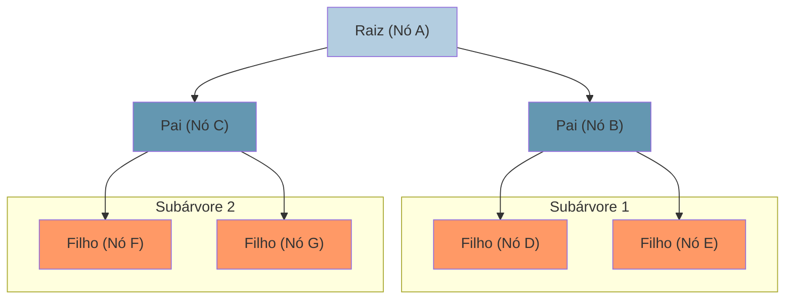
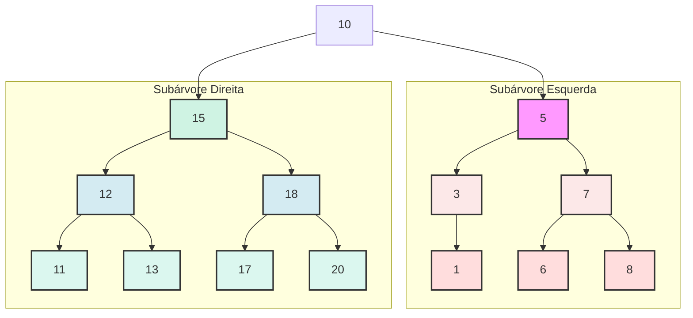

# Estruturas de Dados em Árvores

Olá, eu sou Uanderson, desenvolvedor Backend Java em formação, e a seguir vamos aprender o conceito de Estruturas de Dados em Árvores.

### O Que São Estruturas de Dados em Árvores?

Imagine que você está organizando uma hierarquia, como uma árvore genealógica ou o sistema de pastas de um computador. Estruturas de dados em árvores seguem esse mesmo conceito: elas organizam informações de forma hierárquica, onde cada elemento, chamado de *nó*, se conecta a outros, formando relações de pai e filho.

Na matemática e na computação, as árvores são definidas como um conjunto de nós conectados por arestas. O primeiro nó é chamado de *raiz*, e ele é o ponto de partida da árvore. A partir daí, cada nó pode ter filhos, criando subárvores, e cada filho pode se tornar o pai de outros nós. A estrutura termina quando não há mais filhos, ou seja, os nós finais são chamados de *folhas*.

### Características das Árvores

As árvores possuem várias características que as tornam uma estrutura única e poderosa para representar dados:

1. **Hierarquia Natural**: Diferente das listas e filas, as árvores representam relações hierárquicas. Imagine um organograma de uma empresa, onde o CEO é a raiz, e cada nível abaixo dele representa uma nova camada de gerenciamento.

2. **Unicidade do Caminho**: Em uma árvore, há um único caminho entre dois nós quaisquer, o que garante a ausência de ciclos (laços). Isso diferencia as árvores de outras estruturas, como grafos.

3. **Altura e Profundidade**: A *altura* de uma árvore é a maior distância da raiz até uma folha, e a *profundidade* de um nó é a distância dele até a raiz. Entender esses conceitos é crucial, pois afeta o desempenho de algoritmos de busca e inserção.

4. **Balanceamento**: Algumas árvores são balanceadas, ou seja, suas subárvores possuem alturas semelhantes, o que melhora a eficiência das operações. Árvores como AVL e Red-Black são exemplos de árvores balanceadas.

---

- Estrutura de dados bidimensional
- Não Liner
- Constituída de nós que representam um modelo hierárquico
  - Que armazenam os dados com base em relações de dependências.
- Lista, Filas e Pilhas são estruturas Lineares

Utilização:

- Sistemas de arquivos
- Banco de dados
- Interfaces gráficas
- Páginas web

---

# Estrutura de Dados em Árvores

### Nó

Um ponto em uma árvore. Cada nó pode conter um valor ou dado, e pode ter referências para outros nós.

### Raiz

O nó superior da árvore. É o único nó que não tem um "pai". Todos os outros nós são descendentes dele.

### Pai e Filho

- **Pai**: Um nó que aponta para outros nós.
- **Filho**: Um nó que é apontado por outro nó (pai).

### Irmão

Nós que compartilham o mesmo pai.

### Nível de um Nó

A profundidade do nó na árvore, contando a partir da raiz. A raiz está no nível 0, seus filhos estão no nível 1, e assim por diante.

### Altura ou Profundidade

A distância máxima da raiz até qualquer folha. Representa o maior nível da árvore.

### Folha ou Nó Terminal

Um nó que não tem filhos. Está no final de um caminho na árvore.

### Nó Interno

Um nó que tem pelo menos um filho. Não é uma folha.

### Grau de um Nó

O número de filhos que um nó tem.

### Subárvore

Uma seção da árvore que pode ser considerada uma árvore por si só. Consiste em um nó e todos os seus descendentes.




Nível


Profundidade e nó folha


Nó interno (Aqueles que não são nó folhas)


Grau de um nó (Quantidade de ramificações que possuem/quantos filhos têm)


Subárvore (que possui ramificações/nó filhos)


### Representação Matemática

Matematicamente, uma árvore é um grafo acíclico e conectado que segue as seguintes regras:

- Existe apenas um nó raiz.
- Cada nó (exceto a raiz) possui exatamente um pai.
- Os nós sem filhos são chamados de folhas.

Um dos principais benefícios da árvore é a organização dos elementos de forma a facilitar a busca e a inserção. Por exemplo, em uma *árvore binária de busca* (BST), cada nó segue uma regra simples: todos os valores menores que o nó ficam à esquerda, e todos os maiores, à direita. Isso permite que algoritmos de busca binária sejam aplicados de forma eficiente, com complexidade O(log n) em média.

### Tipos de Árvores

- Árvore Binária
- Árvore AVL
- Árvore Ordenada
- Árvore Rubro-Negra
- Árvore 2-3
- Árvore 2-4
- Árvore B
- Árvore B+
- Árvore Hiperbólica

Existem diversos tipos de árvores, cada uma adaptada a cenários específicos:

1. **Árvore Binária**: É a forma mais básica, onde cada nó possui, no máximo, dois filhos. Pode ser usada para implementar estruturas como BSTs, AVL, e árvores Red-Black.

- Posição dos nós
- Maiores à Direita
- Menores à esquerda



Representação gráfica de uma Árvore


### A interface Comparable

Para que a gente consiga inserir um elemento numa estrutura de dados em árvore, devemos garantir que nossa class/objeto tenha a capacidade de comparar dois elementos do mesmo tipo e definir quem é maior ou menor, ou seja ordenar essa lista (Fazer o sort). Portanto, devemos usar uma variável/valor númerico para poder fazer o cálculo.


### Peculiaridades e Comparações com Outras Estruturas

Comparada com listas, filas e pilhas, a árvore se destaca por sua eficiência em buscas, inserções e remoções, principalmente quando balanceada. Em uma lista, para encontrar um elemento específico, é preciso percorrer cada item até encontrar o desejado (O(n)). Já em uma árvore binária balanceada, a busca é mais rápida, já que é possível eliminar metade dos elementos a cada passo.

### REGRA GERAL

- Maiores para a direita
- Menores para a esquerda

### Tutorial: Operações Básicas em Árvores de Busca Binária

### Estrutura de Dados: Árvores de Busca Binária

Uma árvore de busca binária (ABB) é uma estrutura de dados hierárquica onde cada nó possui, no máximo, dois filhos: um à esquerda e um à direita. Ela é organizada de maneira que:

- O **nó à esquerda** contém valores **menores** que o nó atual.
- O **nó à direita** contém valores **maiores** que o nó atual.

Esse arranjo permite buscas rápidas, inserções e exclusões de maneira eficiente, tornando a ABB uma das estruturas de dados mais úteis em algoritmos e sistemas.


### Operações Básicas

#### 1. Inserção em Árvores de Busca Binária

Para inserir um novo valor na árvore, seguimos uma regra simples:

- Comparamos o valor que queremos inserir com o valor do nó atual (começando pela **raiz**).
- Se o valor for **menor**, vamos para o **nó à esquerda**.
- Se o valor for **maior**, vamos para o **nó à direita**.

Repetimos esse processo até encontrarmos um espaço vazio (uma **folha**), onde inserimos o novo valor.

**Exemplo:** Imagine que queremos inserir o valor 15 em uma árvore com os seguintes valores: 10, 20, 5, 8. O processo seria assim:

- Comparamos 15 com a **raiz** (10). Como 15 é **maior**, vamos para a **direita**.
- O nó à direita da raiz contém o valor 20. Como 15 é **menor** que 20, vamos para o **nó à esquerda** de 20.
- O espaço está vazio? Perfeito! Inserimos o valor 15 aqui.

Esse processo é eficiente e segue o conceito de "divide e conquista", quebrando a árvore em pedaços menores para cada comparação, garantindo inserções rápidas.

#### 2. Exclusão de um Nó

Excluir um nó em uma ABB exige mais atenção para manter a estrutura e as propriedades da árvore intactas. Vamos focar na exclusão da **raiz** para entender o conceito.

Se queremos remover um nó (neste exemplo, a **raiz**), seguimos estes passos:

- Encontramos o **maior valor** do lado **esquerdo** da árvore. Esse valor substituirá o nó que estamos excluindo.
- Por que o maior valor à esquerda? Ele garante que todos os valores à sua esquerda ainda serão menores que ele, e os valores à direita ainda serão maiores que ele, mantendo a integridade da ABB.

**Nota:** Em outros cenários (nós sem filhos ou com um único filho), a exclusão é direta: basta substituir o nó a ser excluído pelo seu único filho ou removê-lo se não tiver filhos.


#### 3. Exibição da Árvore

Para visualizar os elementos de uma ABB de forma ordenada, utilizamos um **algoritmo recursivo** que faz uma **percorre em-ordem**. Isso significa que:

1. Visitamos o **nó à esquerda**.
2. Exibimos o **conteúdo** do nó atual.
3. Visitamos o **nó à direita**.

Esse método garante que a exibição seja feita em ordem crescente.

Veja um exemplo de implementação em Java:

```java
public void exibirArvore(NoBinario noAtual) {
    if (noAtual != null) {
        exibirArvore(noAtual.noEsq);
        System.out.println(noAtual.conteudo);
        exibirArvore(noAtual.noDir);
    }
}
```

Neste código:

Se o nó atual não for nulo, chamamos a função para o nó à esquerda.

Depois exibimos o conteúdo do nó.

Por fim, chamamos a função para o nó à direita.

Essa abordagem recursiva simplifica o processo de exibição, garantindo que percorremos toda a árvore de maneira eficiente.

## Tipos de Atravessamentos em Estruturas de dados em Árvores

- IN-ORDEM 
- PRÉ-OREDEM
- PÓS-ORDEM

## IN-ORDEM

No atravessamento **in-ordem** (ou em-ordem), a ordem de visita dos nós é a seguinte:

1. Visite o **nó à esquerda**.
2. Exiba o **nó atual**.
3. Visite o **nó à direita**.

Este método garante que os valores sejam exibidos em **ordem crescente**.

### Exemplo

Para uma árvore com a estrutura:

```text
    10
   /  \
  5   15
 / \  / \
3  7 12 18
```

A saída do atravessamento in-ordem seria: **3, 5, 7, 10, 12, 15, 18**

```java
public void inOrdem(NoBinario noAtual) {
    if (noAtual != null) {
        inOrdem(noAtual.noEsq);
        System.out.print(noAtual.conteudo + " ");
        inOrdem(noAtual.noDir);
    }
}
```

---

## PRÉ-ORDEM

No atravessamento **pré-ordem** (ou pre-ordem), a ordem de visita dos nós é a seguinte:

1. Exiba o **nó atual**.
2. Visite o **nó à esquerda**.
3. Visite o **nó à direita**.

Este método é útil para **criar uma cópia da árvore**.

### Exemplo

Para a mesma árvore:

```text
    10
   /  \
  5   15
 / \  / \
3  7 12 18
```

A saída do atravessamento pré-ordem seria: **10, 5, 3, 7, 15, 12, 18**


```java
public void preOrdem(NoBinario noAtual) {
    if (noAtual != null) {
        System.out.print(noAtual.conteudo + " ");
        preOrdem(noAtual.noEsq);
        preOrdem(noAtual.noDir);
    }
}
```

---

## PÓS-ORDEM

No atravessamento **pós-ordem** (ou pos-ordem), a ordem de visita dos nós é a seguinte:

1. Visite o **nó à esquerda**.
2. Visite o **nó à direita**.
3. Exiba o **nó atual**.

Este método é útil para **deletar a árvore**.

### Exemplo

Para a mesma árvore:

```text
    10
   /  \
  5   15
 / \  / \
3  7 12 18
```

A saída do atravessamento pós-ordem seria: **3, 7, 5, 12, 18, 15, 10**

```java
public void posOrdem(NoBinario noAtual) {
    if (noAtual != null) {
        posOrdem(noAtual.noEsq);
        posOrdem(noAtual.noDir);
        System.out.print(noAtual.conteudo + " ");
    }
}

```
