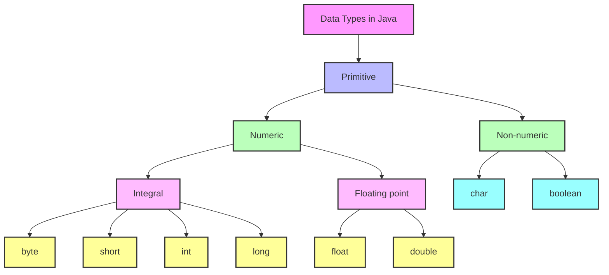
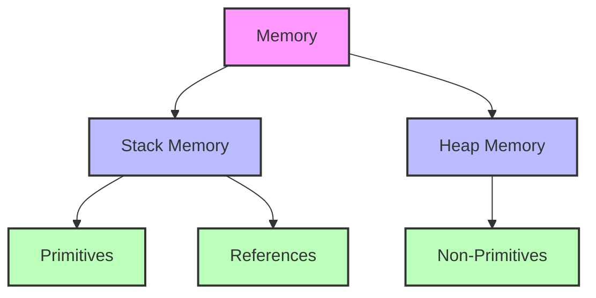
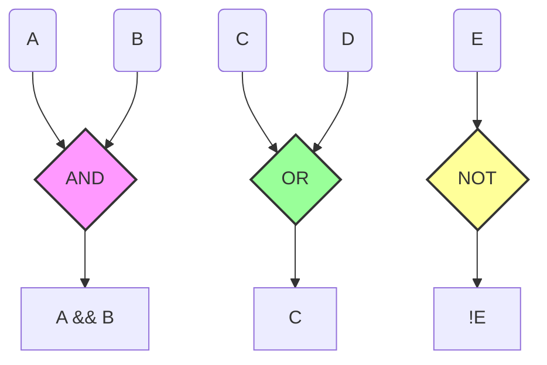

# Oracle Academy - Java Programming

## Fundamentals of java 

## Objectives
- This lesson reviews the following topics
  - Java Primitives
  - Strings 
  - Logical and Relational Operators
  - Conditional Statements
  - Program Control
  - Object Classes
  - Constructor and Method Overloading
  - Inheritance

 ## Primitive Data Types
 - O java têm 8 tipos de dados primitivos, para realização de operações.
 - Os dados primitivos, são um grupo especial de dado, então não se usa `new` para inicializar.
  

- Java cria tipos primitivos como variáveis ​​​​automáticas que não são referências e são armazenadas na memória da pilha com o nome da variável.

  - Stack Memory (Memória de pilha) -> Tipos e referências de dados primitivos.

  - Heap Memory (Memória Heap) -> Tipos de dados não primitivos.




### Primitive Data Types

| Tipo de Dado | Tamanho | Exemplo             | Descrição                                                                                                           |
| ------------ | ------- | ------------------- | ------------------------------------------------------------------------------------------------------------------- |
| byte         | 1 byte  | byte b = 100        | Armazena números inteiros de -128 a 127                                                                             |
| short        | 2 bytes | short s = 1000      | Armazena números inteiros de -32.768 a 32.767                                                                       |
| int          | 4 bytes | int i = 100000      | Armazena números inteiros de -2.147.483.648 a 2.147.483.647                                                         |
| long         | 8 bytes | long l = 100000L    | Armazena números inteiros de -9.223.372.036.854.775.808 a 9.223.372.036.854.775.807                                 |
| float        | 4 bytes | float f = 10.5f     | Armazena números fracionários decimais positivos ou negativos de `1.4023*10-45 a 3.4028*10+38` (32 bits IEEE 754)   |
| double       | 8 bytes | double d = 10.5     | Armazena números fracionários decimais positivos ou negativos de `4.9406*10-324 a 1.7977*10+308` (64 bits IEEE 754) |
| boolean      | 1 bit   | boolean flag = true | Armazena valores booleanos: true ou false                                                                           |
| char         | 2 bytes | char c = '#'        | Armazena um único caractere Unicode                                                                                 |


### Declaring Variables and Using Literals
- A palavra-chave new não é usada ao inicializar um tipo primitivo de variável.
- Em vez disso, um valor literal deve ser atribuído a cada variável na inicialização.
- Um literal pode ser qualquer número, texto ou outra informação que represente um valor.
- Exemplos de declaração de uma variável e atribuição de um valor literal a ela:
  
```java

boolean result = true;
char capitalC = 'C';
byte b = 100;
short s = 10000;
int i = 100000;
long creditCardNumber = 123_5678_9012_3456L;

//Chars use single quotes(' '), strings use double quotes(" ").
```

### Strings

- Uma string é um objeto que contém uma sequência de caracteres.
- Declarar e instanciar uma String é como qualquer outra variável de objeto.
- No entanto, existem diferenças:
  - Eles podem ser instanciados sem usar a palavra-chave `new`.
  - Elas são imutáveis.
  - Uma vez instanciadas, elas são finais e não podem ser alterados
- Objetos String vêm com seu próprio conjunto de métodos

>  **Note:** Lembre-se de que não devemos usar `==` para comparar duas strings. Este teste para igualdade de referência e não para igualdade de valor.

## String Operations

- Você nunca deve comparar o valor de Strings usando o
  Método `==` (equals equals) que você usa com tipos de dados primitivos.

    &#x2718; str1 == str2 &#x2718;

- Isso ocorre porque o operador `==` apenas compara o
conteúdo da memória da pilha, portanto, apenas compara o
String faz referência não aos valores String.

- Ao comparar Strings existem diferentes métodos
  que você pode usar.
- As duas maneiras de fazer isso são o método `compareTo()` e o Método `equals()`.
- As opções são:
   - compareTo(String str)
   - compareToIgnoreCase(String str)
   - Equals(Object obj)
   - EqualsIgnoreCase(String str)

- Método: s1.compareTo(s2);
- Deve ser usado ao tentar encontrar o lexicográfico (lexicographical) ordem de duas strings.
- Retorna um número inteiro
  - se s1 for menor que s2, um int < 0 será retornado.
  - se s1 for igual a s2, 0 é retornado
  - se s1 for maior que s2, um int > 0 será retornado
  - Compara as strings com base na ordem lexicográfica (dicionário).
  - É útil para ordenar strings ou determinar a ordem entre elas.
  - compareTo leva em conta a diferença entre maiúsculas e minúsculas porque usa a ordem Unicode.

- Existe também uma opção que permite ignorar o caso das Strings (compareToIgnoreCase).
  

- Método: s1.equals(s2)
- Deve ser usado quando você deseja apenas descobrir se as duas strings são iguais.
- Retorna um valor booleano
  - se verdadeiro for retornado, s1 é igual a s2
  - se falso for retornado, s1 não é igual a s2
  - Verifica se duas strings têm o mesmo conteúdo exatamente.
  - Útil para verificar se duas strings são "iguais" em termos de conteúdo.
  - equals também diferencia maiúsculas e minúsculas.

> **Note:** Isso só testará a igualdade, não a ordem!

## Console Input
- To read input that the user has entered to the console,
use the Java class Scanner. You will have to use an import
statement to acces the class java.util.Scanner
  - `import java.util.Scanner;`

- To initialize a Scanner, write:
  -  `Scanner in = new Scanner(System.in);`

Example:
```java
public class ImputVariables{
    public static void main(String[] args) {
        Scanner in = new Scanner(System.in);

        boolean boolVal;
        byte byteVal;
        char charVal;
        short shortVal;
        int intVal;
        long longVal;
        float floatVal;
        double doubleVal;
        
        System.out.print("Please enter a boolean value: ");
        boolVal = in.nextBoolean();
        
        System.out.print("Please enter a byte value: ");
        byteVal = in.nextByte();
        
        System.out.print("Please enter a char value: ");
        charVal = in.next().charAt(0);
        
        System.out.print("Please enter a short value: ");
        shortVal = in.nextShort();
        
        System.out.print("Please enter a int value: ");
        intVal = in.nextInt();
        
        System.out.print("Please enter a long value: ");
        longVal = in.nextLong();
        
        System.out.print("Please enter a float value: ");
        floatVal = in.nextFloat();
        
        System.out.print("Please enter a double value: ");
        doubleVal = in.nextDouble();
        
        in.close();
        
        System.out.println("boolean value: " + boolVal);
        System.out.println("byte value:    " + byteVal);
        System.out.println("char value:    " + charVal);
        System.out.println("short value:   " + shortVal);
        System.out.println("int value:     " + intVal);
        System.out.println("long value:    " + longVal);
        System.out.println("float value:   " + floatVal);
        System.out.println("double value:  " + doubleVal);
    }//main
}//class
```

## Relational Operators
- Java possui seis operadores relacionais usados ​​para testar dados primitivos
ou valores numéricos literais.
- Operadores relacionais são usados ​​para avaliar condições if-else e loops.
  

| Relational Operators | Definição                                                           | Exemplo  | Resultado |
| -------------------- | ------------------------------------------------------------------- | -------- | --------- |
| >                    | Verifica se o valor à esquerda é maior que o valor à direita.       | (5 > 3)  | true      |
| >=                   | Verifica se o valor à esquerda é maior ou igual ao valor à direita. | (5 >= 5) | true      |
| <                    | Verifica se o valor à esquerda é menor que o valor à direita.       | (2 < 5)  | true      |
| <=                   | Verifica se o valor à esquerda é menor ou igual ao valor à direita. | (2 <= 3) | true      |
| ==                   | Verifica se dois valores são iguais.                                | (3 == 3) | true      |
| !=                   | Verifica se dois valores são diferentes.                            | (3 != 4) | true      |


## Logic Operators
- Java possui três operadores lógicos usados ​​para combinar expressões booleanas em testes complexos.
  

| Logical Operators | Definição                                                                      | Exemplo           | Resultado |
| ----------------- | ------------------------------------------------------------------------------ | ----------------- | --------- |
| &&                | Operador E (AND) lógico: Retorna true se ambos os operandos forem true.        | (true && false)   | false     |
| \|\|              | Operador OU (OR) lógico: Retorna true se pelo menos um dos operandos for true. | (true \|\| false) | true      |
| !                 | Operador NÃO (NOT) lógico: Inverte o valor booleano do operando.               | !(true)           | false     |





> **Note:** Compreender a lógica booleana é fundamental para a programação!

## If Conditional Statement
- Para construir uma instrução if-else, lembre-se das seguintes regras:
  - Uma instrução if-else precisa de uma condição ou método booleano que seja testado para true/false.
- Por exemplo:
  - if(x == 5)
  -  if(y >= 17)
  -  if(s1.equals(s2))
example:
```java
if(x == 5){
  //print
}else if(x == 7){
  //print
}else{
  //print
}
```

## Loops
### While
- Com um loop while, o java usa a sintaxe:
```java
while(condition is true){
  //logica
}
```
- Semelhante às instruções if, os parâmetros do loop while podem ser do tipo booleano ou podem ser equivalentes a um valor booleano.
- Instruções condicionais (<,>,<=, =>, !=, ==) equivalem a valores booleanos.
  - Examples:
    - while (num1 < num2>)
    - while (isTrue)
    - while (n != 0)
  
### do While
- Com um loop do-while, o java usa a sintaxe:
```java
do{
  //statements(declarações) to repeat go here
}while(condition);
```
- O loop do-while:
  - É um loop pós-teste
  - É um loop while modificado que permite que o programa 
    seja executado através do loop uma vez antes de testar a 
    condição booleana.
  - Continua até que a condição se torne falsa.
  
- Se você não permitir uma alteração na condição, ambos
  os loops while e do-while serão executados para sempre como 
  um loop infinito.

### for
- Com um loop for, o java usa a sintaxe:
```java
for(int i = 0; i < timesToRun; i++){
  //logica
}
```
- O loop for repete o código um número predefinido de vezes
- A sintaxe de um loop for contém três partes:
  - Inicializando o contador do loop (int i = 0;)
  - Instrução condicional ou condição de parada (i < timesToRun;)
  - Atualizando o contador (indo para o próximo valor (i++))
    - Pense em i como um contador começando em 0 e aumentando até que o valor de i falhe na condição de parada.

### Entendendo i++ e --i
Em Java (e em muitas outras linguagens de programação), os operadores de incremento (`++`) e decremento (`--`) são usados para aumentar ou diminuir o valor de uma variável inteira. Esses operadores podem ser usados em duas formas: prefixada e posfixada.

### Incremento (`++`)

1. **`i++` (posfixado)**:
   - Primeiro, o valor atual da variável `i` é utilizado na expressão.
   - Depois, `i` é incrementado em 1.
   - Exemplo:
     ```java
     int i = 5;
     int j = i++;  // j recebe 5, depois i é incrementado para 6
     ```

2. **`++i` (prefixado)**:
   - Primeiro, `i` é incrementado em 1.
   - Depois, o novo valor de `i` é utilizado na expressão.
   - Exemplo:
     ```java
     int i = 5;
     int j = ++i;  // i é incrementado para 6, depois j recebe 6
     ```

### Decremento (`--`)

1. **`i--` (posfixado)**:
   - Primeiro, o valor atual da variável `i` é utilizado na expressão.
   - Depois, `i` é decrementado em 1.
   - Exemplo:
     ```java
     int i = 5;
     int j = i--;  // j recebe 5, depois i é decrementado para 4
     ```

2. **`--i` (prefixado)**:
   - Primeiro, `i` é decrementado em 1.
   - Depois, o novo valor de `i` é utilizado na expressão.
   - Exemplo:
     ```java
     int i = 5;
     int j = --i;  // i é decrementado para 4, depois j recebe 4
     ```

### Resumo das diferenças

- **Prefixado (`++i` e `--i`)**: O valor da variável é modificado antes de ser utilizado na expressão.
- **Posfixado (`i++` e `i--`)**: O valor da variável é utilizado na expressão antes de ser modificado.

### Exemplos Práticos

```java
public class IncrementDecrementExample {
    public static void main(String[] args) {
        int i = 10;

        // Uso de i++
        System.out.println(i++);  // Imprime 10, depois i se torna 11
        System.out.println(i);    // Imprime 11

        // Uso de ++i
        System.out.println(++i);  // i se torna 12, depois imprime 12
        System.out.println(i);    // Imprime 12

        // Uso de i--
        System.out.println(i--);  // Imprime 12, depois i se torna 11
        System.out.println(i);    // Imprime 11

        // Uso de --i
        System.out.println(--i);  // i se torna 10, depois imprime 10
        System.out.println(i);    // Imprime 10
    }
}
```

Exemplo 01:

```java
int i = 0;
i++;
if (i++ > 1){
    i++;
}
System.out.println(i);
```

### Resumo do processo

Aqui está um resumo das etapas:

1. `i = 0`
2. `i++` → `i` se torna `1`
3. `if (i++ > 1)` → `i` se torna `2` após a comparação `1 > 1` (que é `false`)
4. Como a condição do `if` é `false`, `i++` dentro do `if` não é executado
5. `System.out.println(i)` imprime `2`


Exemplo 02:

```java
int x = 0;
++x;

if (x++ >= 1) {
    x++;
}
System.out.println(x);
```

### Resumo do processo

1. `x = 0`
2. `++x` → `x` se torna `1` (incremento prefixado)
3. `if (x++ >= 1)` → `x` é `1` durante a comparação, então `1 >= 1` é `true`. Depois, `x` se torna `2` (incremento posfixado)
4. Como a condição do `if` é `true`, `x++` dentro do `if` é executado, incrementando `x` de `2` para `3`
5. `System.out.println(x)` imprime `3`

Portanto, a saída do programa é `3`.

Exemplo 03:

```java
int x = 0;
++x;

if (x++ >= 1) {
    x += ++x;
}
System.out.println(x);
```

### Resumo do processo

1. `x = 0`
2. `++x` → `x` se torna `1` (incremento prefixado)
3. `if (x++ >= 1)` → `x` é `1` durante a comparação, então `1 >= 1` é `true`. Depois, `x` se torna `2` (incremento posfixado)
4. Como a condição do `if` é `true`, `x += ++x` é executado:
   - `++x` → `x` se torna `3` (incremento prefixado)
   - `x += 3` → `x` se torna `2 + 3 = 5`
5. `System.out.println(x)` imprime `5`

Portanto, a saída do programa é `5`.


## Array
- Uma matriz (An array) é uma coleção de valores do mesmo tipo de dados armazenado em um objeto contêiner.
- O comprimento do array é definido quando o array é declarado.
- Exemplos de matrizes(Arrays):
```java
String[] myBouquet = new String[6]; //Length = 6

int[] numbers = {7, 24, 352, 2, 37} //Length = 5

```
- Os elementos de endereço(posição) variam de 0 a `length - 1`
  
| Address Element | 0  | 1  | 2   | 3  | 4  |
|-----------------|----|----|-----|----|----|
| value           | 7  | 24 | 352 | 2  | 37 |

### Lista resumida com a sintaxe de cada uma das declarações de arrays em Java

1. **Declaração com Tamanho Específico sem Inicialização**:
    ```java
    String[] myBouquet = new String[6];
    int[] numbers = new int[5];
    ```

2. **Declaração com Inicialização de Elementos**:
    ```java
    int[] numbers = {7, 24, 352, 2, 37};
    String[] flowers = {"Rose", "Lily", "Tulip", "Daisy"};
    ```

3. **Declaração e Inicialização com Tamanho Específico e Elementos**:
    ```java
    int[] numbers = new int[]{7, 24, 352, 2, 37};
    String[] flowers = new String[]{"Rose", "Lily", "Tulip", "Daisy"};
    ```

4. **Declaração de Arrays Multidimensionais**:
    - **Array Bidimensional (Matriz)**:
        ```java
        int[][] matrix = new int[3][3];
        int[][] predefinedMatrix = {
            {1, 2, 3},
            {4, 5, 6},
            {7, 8, 9}
        };
        ```
    - **Array Tridimensional**:
        ```java
        int[][][] threeDArray = new int[3][3][3];
        int[][][] predefinedThreeDArray = {
            {
                {1, 2, 3},
                {4, 5, 6},
                {7, 8, 9}
            },
            {
                {10, 11, 12},
                {13, 14, 15},
                {16, 17, 18}
            },
            {
                {19, 20, 21},
                {22, 23, 24},
                {25, 26, 27}
            }
        };
        ```

5. **Declaração e Inicialização em Linhas Separadas**:
    ```java
    int[] numbers;
    numbers = new int[]{7, 24, 352, 2, 37};
    ```

  **======================================================**

## Overloading Constructor
- Construtores atribuem valores iniciais às variáveis ​​de instância de uma classe
– Construtores dentro de uma classe são declarados como métodos
- Sobrecarregar um construtor significa ter mais de um construtor com o mesmo nome.
- No entanto, o número de argumentos seria diferente, e/ou
os tipos de dados dos argumentos seriam diferentes.
  
 ## Constructor with parameters
- Um construtor com parâmetros é usado quando você quiser
  para inicializar os campos com valores diferentes do padrão
  valores.
  ```java
      public Student(String n, String ssn){
        name = n;
        this.ssn = ssn;
      }
  ```
  - Para instanciar a instância de Student usando o construtor com parâmetros, escreva:
    ```java
      Student student1 = new Student("Zina","3003456");
    ```

## Components of a Method
- Uma assinatura de método é o nome e os parâmetros.
- Tipo de retorno:
  - Isso identifica que tipo de objeto, se houver, será retornado quando o método for invocado (chamado)
  - Se nada for retornado, o tipo de retorno é declarado nulo.
- Nome do método: Usado para fazer uma chamada ao método
```java
  public void displayName(){
    System.out.println(createName());
  }

  private String createName(){
    return ( this.firstName + " " + this.lastName );
  }
```
## Parameter(s):
- O programador pode optar por incluir parâmetros
    dependendo da finalidade, da função do método.
- Os parâmetros podem ser de qualquer tipo de objeto ou primitivo, mas o tipo de parâmetro usado ao chamar o método deve corresponder ao tipo de parâmetro especificado na definição do método.


## Class Methods
- Cada classe pode ter um conjunto de métodos associados a ela que permitem funcionalidade para a classe.
  - Método acessador (Accessor method)
    - Frequentemente chamado de método "getter"
    - Retorna o valor de uma variável de instância específica
  - Método mutador (Mutator method)
    - Frequentemente chamado de método "setter"
    - Altera ou define o valor de uma variável de instância específica
  - Método funcional (Functional method)
    - Retorna ou executa algum tipo de funcionalidade para a classe

## Accessor Methods 
- Os métodos acessadores (getters) acessam e retornam o valor de um campo de instância específico da classe
- O tipo de retorno não nulo corresponde ao tipo de dados do campo de instância que você está acessando.
- Inclui uma declaração de devolução
- Geralmente não há parâmetros
```java
  public String getName(){
    return name;
  }

    public int getStudentId(){
    return studentId;
  }

```
## Mutator Methods
- métodos mutadores (setters) definem ou modificam o valor de um campo de instância especificado da classe.
- Têm um tipo de retorno void
- O parâmetro possui um tipo que corresponde ao tipo do campo de instância que está sendo definido.
```java
  public void setName(String name){
    this.name = name;
  }

    public void setStudentId(int id){
      studentId = id;
  }

```
## Functional Methods
- Os métodos funcionais executam uma função ou comportamento para a classe.
- Pode ter tipo de retorno nulo ou não nulo.
- Os parâmetros são opcionais e utilizados dependendo do que é necessário para o funcionamento do método.
```java
private String createName(){
  return (this.firstName + " " + this.lastName );
}

```

## Overloading Methods
- Assim como você usou sobrecarga ao criar seus construtores, você também pode sobrecarregar métodos (comportamentos/behaviours).
- Um método sobrecarregado deve ter uma assinatura de método diferente
  - O número de parâmetros deve ser diferente
  - O tipo de parâmetros deve ser diferente
  - O número ou ordem dos tipos de parâmetros deve ser diferente
- Os nomes dos parâmetros não fazem parte da assinatura do método.
- Exemplo:
```java
  - Método soma(int a, int b): Soma dois números inteiros.
  - Método soma(int a, int b, int c): Soma três números inteiros.
  - Método soma(double a, double b): Soma dois números em ponto flutuante (double).
  - Método soma(int a, double b): Soma um número inteiro e um número em ponto flutuante.
  - Método soma(double a, int b): Soma um número em ponto flutuante e um número inteiro.
```
## Main Method
- Para executar um programa Java, é necessário definir um método main em uma classe que chamamos de "classe driver". A classe driver é o ponto de entrada do programa, onde a execução começa, a classe principal.
- O método principal (main) é chamado automaticamente quando a classe é chamada.
- Exemplo:
```java
public class StudentTester{

  public static void main(String args[]){

  }

}
```

## Superclass versus Subclass
- As classes podem derivar ou evoluir de classes pais, o que significa que contêm os mesmos métodos e campos que seus pais, mas podem ser consideradas uma forma mais especializada de suas classes pais.
- A diferença entre uma subclasse e uma superclasse é a seguinte:

| Termo           | Descrição                                                                    |
|-----------------|------------------------------------------------------------------------------|
| **Superclasse** | A classe mais geral da qual outras classes derivam seus métodos e dados.     |
| **Subclasse**   | A classe mais específica que deriva ou herda de outra classe (superclasse).  |

- **Superclasses:**
  - Contém métodos e campos que são transmitidos a todas as suas subclasses.
- **Subclasses:**
  - Herdar métodos e campos de suas superclasses
  - Pode definir métodos ou campos adicionais que a superclasse não possui
  - Pode redefinir/sobreescrever (override) métodos herdados da superclasse.
  
  ```mermaid
  classDiagram
    class Person {
        -String name
        +void displayName()
    }
    class Student {
        -double avgMark
        +void updateMark(double newMark)
    }
    class Teacher {
        -double salary
        +void setSalary(double newSalary)
    }

    Person <|-- Student
    Person <|-- Teacher

    class Person {
        <<Superclass>>
    }

    class Student {
        <<Subclass>>
    }

    class Teacher {
        <<Subclass>>
    }

    style Person fill:#f9f,stroke:#333,stroke-width:2px;
    style Student fill:#9f9,stroke:#333,stroke-width:2px;
    style Teacher fill:#ff9,stroke:#333,stroke-width:2px;
  ```

### Extends Keyword
- Em Java, você pode escolher de qual classe deseja herdar usando a palavra-chave `extends`.
- A palavra-chave `extends` permite designar a superclasse que possui métodos que você deseja herdar, ou cujos métodos e dados você deseja estender.
- Por exemplo, para herdar métodos da classe Shape, use `extends` quando a classe Rectangle for criada.
  
```java
public class Rectangle extends Shape{
  //code
}
```

### More About Inheritance(Herança)

- Herança é uma rua de mão única
- As subclasses herdam de superclasses, mas as superclasses não podem acessar ou herdar métodos e dados de suas subclasses
- É assim como os pais não herdam características genéticas, como a cor do cabelo ou dos olhos dos filhos.
- Um aluno tem acesso ao campo nome na superclasse, mas a classe Pessoa não tem conhecimento da nota média do aluno.

  ```mermaid
  classDiagram
    class Person {
        -String name
        +void displayName()
    }
    class Student {
        -double avgMark
        +void updateMark(double newMark)
    }

    Person <|-- Student

    class Person {
        <<Superclass>>
    }

    class Student {
        <<Subclass>>
    }

    style Person fill:#f9f,stroke:#333,stroke-width:2px;
    style Student fill:#9f9,stroke:#333,stroke-width:2px;
  ```

## Object: The Highest Superclass

- Toda superclasse estende implicitamente a classe Object
- Object:
    - É considerado o componente mais elevado e geral de qualquer hierarquia. É a única classe que não possui uma superclasse.
    - Contém métodos muito gerais/genericos que cada classe herda
- A API Java possui mais informações sobre a classe do Object:
<a href="https://docs.oracle.com/javase/10/docs/api/java/lang/Object.html">documentation</a>

> **Note:** Java suporta apenas herança única. Isso significa que ele só pode estender uma classe, e não várias classes.

## Encapsulation

- Encapsulamento é um conceito fundamental na programação orientada a objetos
- Encapsulamento significa colocar algo em uma cápsula ou recipiente, como colocar uma carta em um envelope.
- Na programação orientada a objetos, o encapsulamento envolve ou envolve o funcionamento interno de uma instância/objeto Java.

> **Note:** private | public | protected | default

### How Encapsulation works

- Os campos de dados privados ficam ocultos do usuário do objeto
- Os métodos públicos podem fornecer acesso aos dados privados, mas os métodos ocultam a implementação
- Encapsular seus dados evita que eles sejam modificados pelo usuário ou outras classes para que os dados não sejam corrompidos.

Claro, aqui está a tradução com as terminologias em inglês mantidas entre parênteses:

## Terminologia

- Termos-chave usados nesta lição incluem:
  - Primitivos Java (Java Primitives)
  - Strings
  - Operadores Lógicos e Relacionais (Logical and Relational Operators)
  - Declarações Condicionais (Conditional Statements)
  - Controle de Programas (Program Control)
  - Classes de Objetos (Object Classes)
  - Sobrecarga de Construtor e Método (Constructor and Method Overloading)
  - Herança (Inheritance)
  - Encapsulamento (Encapsulation)

## Summary

- Nesta lição, você deve ter aprendido a:
  - usar primitivos Java (Java primitives)
  - usar Strings
  - usar operadores lógicos e relacionais (Logical and Relational operators)
  - usar declarações condicionais (conditional statements)
  - usar controle de programas (program control)
  - entender classes de objetos (object classes)
  - entender sobrecarga de construtor e método (constructor and method overloading)
  - entender herança (inheritance)
  - entender encapsulamento (encapsulation)