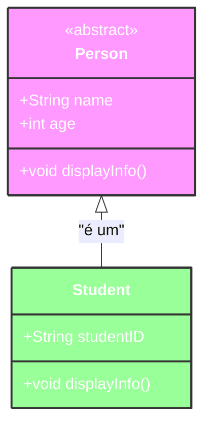
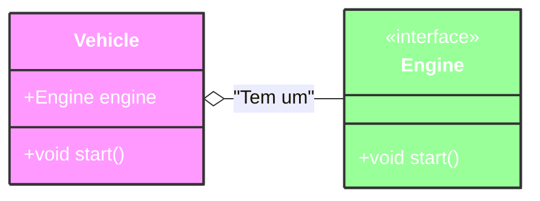

# Oracle Academy - Programação Java

## Java Class Design – Abstract Classes

### Visão Geral

- Esta lição abrange os seguintes tópicos:
    - Usar classes abstratas
    - Usar invocação de método virtual
    - Usar o operador `instanceof` para comparar tipos de objeto
    - Usar conversões (casts) upward e downward

## Classes Abstratas

Uma classe abstrata fornece uma classe base da qual outras classes se estendem.
- Classes abstratas podem fornecer:
    - **Métodos implementados**: aqueles que são totalmente implementados, e suas classes filhas podem usá-los. Possuem corpo (`method() { corpo }`).
    - **Métodos abstratos**: aqueles que não têm implementação e requerem que as classes filhas os implementem. Não possuem corpo (`method();`).
- Classes abstratas não podem ser instanciadas diretamente, mas podemos criar subclasses ou classes aninhadas estáticas para instanciá-las.

### Características de uma Classe Abstrata

- Deve ser definida usando a palavra-chave `abstract`.
- Não pode ser instanciada em objetos.
- Pode ter variáveis ​​declaradas locais.
- Pode ter definições e implementações de métodos.
- Deve ser subclassificada (usando `extends`) em vez de implementada (usando `implements`).

> Nota: Ao contrário de uma classe normal, não podemos criar uma instância de uma classe abstrata.


### Classes Abstratas:

1. **Herança e Uso:**
   - Quando uma classe concreta utiliza uma classe abstrata, ela deve herdar dela. Essa herança impede que a classe concreta herde de outra classe.
   
2. **Importância:**
   - Classes abstratas são cruciais quando todas as classes derivadas precisam compartilhar certos métodos.

3. **Alternativa:**
   - Uma alternativa é usar uma interface. Nesse caso, é necessário definir pelo menos uma classe concreta que implemente a interface.
   
4. **Flexibilidade:**
   - Ao usar uma classe concreta como tipo de objeto para uma variável em vários programas, há mais flexibilidade.

5. **Implementação Obrigatória:**
   - Ao criar uma subclasse de uma classe abstrata, é obrigatório implementar seus métodos abstratos.

### Escolha entre Classe Abstrata e Interface:

- Não existe uma regra rígida sobre o uso de interfaces, classes abstratas ou ambos.
  
- Geralmente, uma classe abstrata tem um relacionamento mais sólido com as classes que a derivam do que as interfaces.

- Classes e interfaces podem implementar várias interfaces, enquanto uma classe só pode ser uma subclasse de uma classe abstrata.

- As classes abstratas permitem a definição de métodos.

## Classe abstrata ou interface?

As classes abstratas geralmente têm um relacionamento “É-Um” (“ Is-A”)

- Um aluno é uma pessoa, então Pessoa pode ser
melhor como uma classe abstrata.



As interfaces geralmente têm um relacionamento “Has-A” (Tem um)

- Um veículo tem um motor, então o motor pode ser melhor como uma
Interface



## Invocação de Método Virtual

- A invocação de método virtual é o processo pelo qual Java identifica a classe real de um objeto e chama a implementação de um método dessa classe.

- Quando a máquina virtual Java invoca um método estático (de classe), ela seleciona o método a ser invocado com base no tipo da referência, que é conhecido em tempo de compilação.

- Por outro lado, quando a máquina virtual invoca um método de instância, ela seleciona o método a ser invocado com base na classe real do objeto, que só pode ser conhecida em tempo de execução.

> **Nota:** "Conhecido em tempo de compilação" refere-se às informações que o compilador pode verificar e resolver antes que o programa seja executado. O compilador Java pode verificar a sintaxe, tipos de dados e a estrutura do código durante o processo de compilação.

> **Nota:** "Conhecido em tempo de execução" refere-se às informações que só estão disponíveis enquanto o programa está sendo executado.

### Exemplo de Invocação de Método Virtual Explicado

- O método `toString()` usa a invocação de método virtual ao chamar o método `toString()` das diferentes subclasses que o sobrescrevem (`@Override`).

- A decisão é tomada pela JVM para chamar o método `toString` implementado nas subclasses (`@Override`) em vez do método `toString` na superclasse ou na classe `Object`.

> **Nota:** Lembre-se de que ainda podemos acessar o método `toString` do pai chamando `super.toString()`.

### O Operador `instanceof`

- O operador `instanceof` permite determinar o tipo de um objeto.

- Ele recebe um objeto no lado esquerdo do operador e um tipo no lado direito do operador, retornando um valor booleano que indica se o objeto pertence a esse tipo ou não.

Por exemplo:
- `(obj instanceof String)` retornaria `true` se `obj` for uma instância de `String`.
- `(obj instanceof Integer)` retornaria `false` se `obj` não for uma instância de `Integer`.

> **Nota:** Normalmente, você usaria o operador `instanceof` quando tiver uma referência ou parâmetro para um objeto que é de uma superclasse ou tipo de interface e precisar saber a que tipo de objeto ele se refere.

### Upcasting e Downcasting em Java

#### Casting
**Casting** é o processo de converter o tipo de um objeto durante uma atribuição. Em Java, existem dois tipos principais de casting entre objetos: upcasting e downcasting.

### Upcasting
**Upcasting** é o processo de converter uma referência de um objeto de uma subclasse para uma referência de sua superclasse. Este processo é implícito e não requer um operador de cast explícito.

**Características do Upcasting:**
- **Perda de Acesso a Métodos Especializados:** Quando você faz um upcasting, perde o acesso aos métodos específicos da subclasse que não estão definidos na superclasse. Isso ocorre porque a referência agora é do tipo da superclasse.
- **Segurança:** Upcasting é seguro porque uma subclasse é sempre uma instância válida de sua superclasse. Todos os métodos e campos definidos na superclasse estão disponíveis.
- **Conversão Implícita:** Java realiza a conversão de upcasting automaticamente sem precisar especificar o novo tipo.

**Exemplo:**
```java
class Animal {
    void makeSound() {
        System.out.println("Some generic animal sound");
    }
}

class Dog extends Animal {
    void bark() {
        System.out.println("Bark");
    }
}

public class Main {
    public static void main(String[] args) {
        Dog dog = new Dog();
        Animal animal = dog; // Upcasting
        animal.makeSound(); // Válido
        // animal.bark(); // Erro de compilação, método não acessível
    }
}
```
No exemplo acima, `Dog` é convertido para `Animal`, perdendo acesso ao método `bark`.

### Downcasting
**Downcasting** é o processo de converter uma referência de um objeto de uma superclasse para uma referência de sua subclasse. Este processo requer um operador de cast explícito e pode causar uma exceção `ClassCastException` se o objeto não for realmente uma instância da subclasse.

**Características do Downcasting:**
- **Ganho de Acesso a Métodos Especializados:** Quando você faz um downcasting, ganha acesso aos métodos e campos específicos da subclasse.
- **Risco:** Downcasting pode ser arriscado se o objeto real não for uma instância da subclasse. Portanto, deve-se usar o operador `instanceof` para verificar a classe real do objeto antes de fazer o downcasting.
- **Conversão Explícita:** Java requer a especificação explícita do tipo durante o downcasting.

**Exemplo:**
```java
class Animal {
    void makeSound() {
        System.out.println("Some generic animal sound");
    }
}

class Dog extends Animal {
    void bark() {
        System.out.println("Bark");
    }
}

public class Main {
    public static void main(String[] args) {
        Animal animal = new Dog();
        if (animal instanceof Dog) { // Verificação para segurança
            Dog dog = (Dog) animal; // Downcasting
            dog.bark(); // Válido
        }
    }
}
```
No exemplo acima, `animal` é convertido para `Dog` após a verificação com `instanceof`, permitindo acesso ao método `bark`.

### Comparação com Casting de Tipos Primitivos
O casting de objetos em Java é semelhante ao casting de tipos primitivos, mas com algumas diferenças importantes:

**Casting de Tipos Primitivos:**
- **Upcasting (Ampliação):** Converter de um tipo menor para um tipo maior. Exemplo: `int` para `double`.
  ```java
  int simpleNumber = 34;
  double complexNumber = simpleNumber; // Conversão implícita, sem perda de precisão
  ```

- **Downcasting (Redução):** Converter de um tipo maior para um tipo menor. Exemplo: `double` para `int`.
  ```java
  double complexNumber = 45.75;
  int simpleNumber = (int) complexNumber; // Conversão explícita, perda de precisão
  ```

### Resumo
- **Upcasting:** Converte uma referência de subclasse para uma referência de superclasse, perdendo o acesso a métodos especializados, mas sem risco de exceções.
- **Downcasting:** Converte uma referência de superclasse para uma referência de subclasse, ganhando acesso a métodos especializados, mas requerendo verificação para evitar exceções em tempo de execução.

Terminology

Key terms used in this lesson included: 
- Interface
- Abstract class
- Virtual method invocation 
- instanceof
- Casting
- Upward cast
- Downward cast