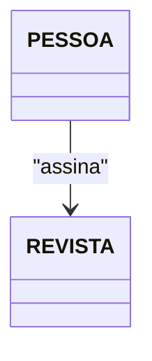
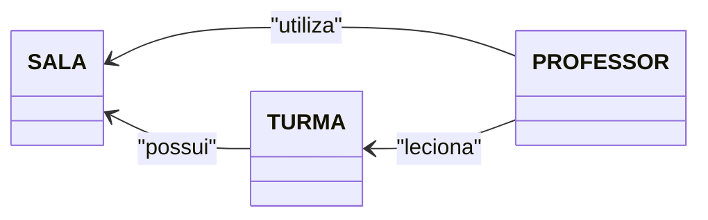
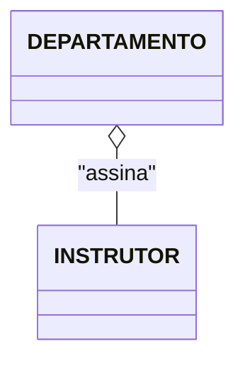
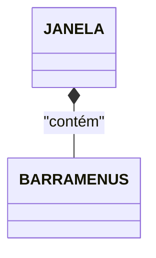
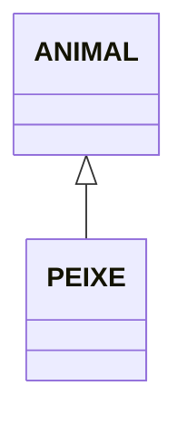
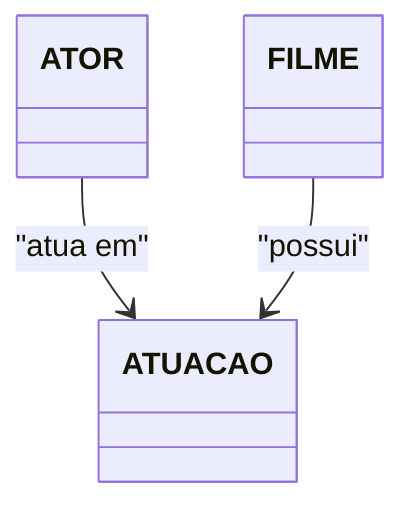

# O que é um Diagrama de Classes?

Os diagramas representam duas visões distintas de um modelo de sistema:

- **Estática (Estrutural)** - Estrutura estática por meio de objetos, operações, relações e atributos.
- **Dinâmica (Comportamental)** - Comportamento dinâmico por meio de colaboração entre os objetos e mudanças de seus estados internos.

## Multiplicidade na UML

A multiplicidade é usada para determinar o número mínimo e o número máximo de objetos envolvidos na associação, de cada lado, e também pode especificar o nível de dependência entre os objetos.

- **0..1**: Zero ou um. Isso significa que a associação pode não existir ou pode ter no máximo um objeto.
- **1..1**: Exatamente um. Cada objeto em uma extremidade da associação está relacionado com exatamente um objeto na outra extremidade.
- **0..***: Zero ou mais. A associação pode não existir ou pode envolver qualquer número de objetos.
- **1..***: Um ou mais. A associação deve envolver pelo menos um objeto, mas pode envolver qualquer número de objetos.
- ***:** Qualquer quantidade. Essa multiplicidade indica que a associação pode envolver qualquer número de objetos, sem um mínimo específico.
- **2..7**: De dois a sete. A associação deve envolver pelo menos dois e no máximo sete objetos.

---

### **Explicação Adicional**

- **Unidirecionalidade**: O relacionamento pode ser unidirecional (navegável apenas de um lado).
- **Bidirecionalidade**: Relacionamento navegável de ambos os lados.

---

## Relacionamento de Associação

Relacionamento mais forte do que a dependência, indica que a classe mantém uma referência a outra classe ao longo do tempo. As associações podem conectar mais de duas classes.

Do tipo "Classe A tem uma Classe B".



Em Java:

```java
class Pessoa {
    private Revista revista;
}

class Revista {
}
```

---

## Associação Ternária

Associação que conecta objetos de três classes. Um losango indica o ponto de convergência (conexão) das classes envolvidas.



---

## Relacionamento de Agregação

Relacionamento mais específico do que a associação, indica que uma classe é um contêiner ou uma coleção de outras classes. As classes contidas não dependem do contêiner - assim, quando o contêiner é destruído, as classes continuam existindo.

Do tipo "Classe A possui uma Classe B ou mais".



Em Java:

```java
class Departamento {
    private List<Instrutor> instrutores;
}

class Instrutor {
}
```

---

## Relacionamento de Composição (+ Forte)

Variação mais específica da agregação, este relacionamento indica uma dependência de ciclo de vida forte entre as classes, de modo que quando um contêiner é destruído, seu conteúdo também o é.

Do tipo "Classe A é parte da classe B".



Em Java:

```java
class Janela {
    private BarraMenus barraMenus = new BarraMenus();
}

class BarraMenus {
}
```

---

## Relacionamento de Generalização/Especialização

Relacionamento entre itens gerais (superclasses/classes-mãe) e tipos mais específicos desses itens (subclasses/classes-filha). Representa a herança entre as classes.

Do tipo "Classe A é um tipo de Classe B".



Em Java:

```java
class Animal {
    void respirar() {
        System.out.println("Respirando...");
    }
}

class Peixe extends Animal {
    void nadar() {
        System.out.println("Nadando...");
    }
}
```

---

## Classe Associativa

São produzidas quando ocorrem associações com multiplicidade "muito (*)" em todas as extremidades. No geral, existem atributos da associação que não podem ser armazenados em nenhuma das classes envolvidas.



Em Java:

```java
class Ator {
    private List<Atuacao> atuacoes;
}

class Filme {
    private List<Atuacao> atuacoes;
}

class Atuacao {
    private Ator ator;
    private Filme filme;
}
```

