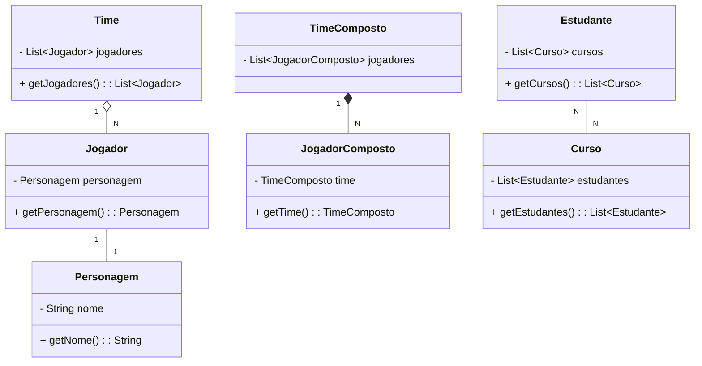

JOGADOR 1 -- 1 PERSONAGEM

TIME 1 -- N JOGADOR

JOGADOR N -- 1 TIME

ESTUDANTE N -- N CURSOS

### **Associações na Orientação a Objetos**

Em Java (e em UML), as associações representam **relações** entre classes. Existem três tipos principais de associação, com características específicas:

---

### **1. Associação Simples**
- **Definição**: Representa uma relação entre classes sem vínculos fortes.
- **Exemplo UML**: **Jogador** e **Personagem** têm uma associação simples.
  - Um **Jogador** tem exatamente **1 Personagem**.
  - UML: `1 -- 1`.

```java
class Jogador {
    private Personagem personagem; // Associação simples

    public Jogador(Personagem personagem) {
        this.personagem = personagem;
    }

    public Personagem getPersonagem() {
        return personagem;
    }
}

class Personagem {
    private String nome;

    public Personagem(String nome) {
        this.nome = nome;
    }

    public String getNome() {
        return nome;
    }
}
```

---

### **2. Agregação**
- **Definição**: Representa uma relação "tem-um" mais fraca. Os objetos podem existir independentemente.
- **Exemplo UML**: **Time** agrega vários **Jogadores**.
  - Um **Time** tem **N Jogadores**, mas um **Jogador** pode existir sem um **Time**.
  - UML: `1 --<> N`.

```java
import java.util.List;

class Time {
    private List<Jogador> jogadores; // Agregação

    public Time(List<Jogador> jogadores) {
        this.jogadores = jogadores;
    }

    public List<Jogador> getJogadores() {
        return jogadores;
    }
}
```

---

### **3. Composição**
- **Definição**: Representa uma relação "parte de". Se o todo for destruído, as partes também são.
- **Exemplo UML**: **Jogador** compõe exatamente **1 Time**.
  - Um **Time** contém **N Jogadores**, que não podem existir fora dele.
  - UML: `N --* 1`.

```java
class JogadorComposto {
    private TimeComposto time; // Composição

    public JogadorComposto(TimeComposto time) {
        this.time = time;
    }

    public TimeComposto getTime() {
        return time;
    }
}

class TimeComposto {
    private List<JogadorComposto> jogadores;

    public TimeComposto(List<JogadorComposto> jogadores) {
        this.jogadores = jogadores;
    }
}
```

---

### **4. Associação Bidirecional**
- **Definição**: Representa uma relação em que ambas as classes sabem uma da outra.
- **Exemplo UML**: **Estudante** e **Curso** têm relação `N -- N`.
  - Um **Estudante** pode estar em **N Cursos** e um **Curso** pode ter **N Estudantes**.

```java
import java.util.List;

class Estudante {
    private List<Curso> cursos;

    public Estudante(List<Curso> cursos) {
        this.cursos = cursos;
    }

    public List<Curso> getCursos() {
        return cursos;
    }
}

class Curso {
    private List<Estudante> estudantes;

    public Curso(List<Estudante> estudantes) {
        this.estudantes = estudantes;
    }

    public List<Estudante> getEstudantes() {
        return estudantes;
    }
}
```

---

### **Diagrama UML usando Mermaid**



---