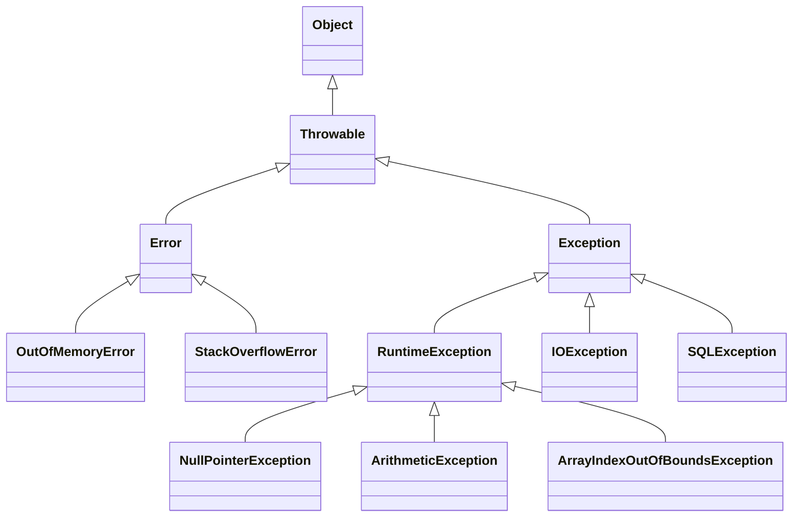

### Exceções em Java na Prática: Tratando Problemas com Elegância  

Olá! Eu sou Uanderson, um desenvolvedor backend Java em formação, e hoje vou conversar com você, que está começando sua jornada como desenvolvedor júnior, sobre um tema essencial: exceções em Java. Vamos explorar juntos como lidar com erros no código, criar tratamentos eficazes e até desenvolver suas próprias exceções personalizadas. No final, você vai estar mais preparado para encarar desafios em projetos reais e colaborar de forma produtiva em equipe.  

---

### **O Que São Exceções?**  

Imagine que você está dirigindo e, de repente, um pneu fura. Isso é um evento inesperado que interrompe sua viagem, mas não significa que a viagem acabou. Você pode trocar o pneu e seguir em frente.  

As exceções em Java são como esses imprevistos: situações anormais que ocorrem durante a execução do programa. Elas não precisam derrubar tudo, mas precisam ser tratadas para que o programa continue funcionando.  

---

### **Tipos de Exceções em Java**  

Java categoriza as exceções em três tipos principais:  

#### 1. **Errors (Erros)**  
Esses são problemas graves, geralmente relacionados ao ambiente de execução (JVM). São situações como falta de memória ou falha ao carregar uma classe.  
- **Exemplo:** `OutOfMemoryError`, `StackOverflowError`.  
- **Dica:** Não tente tratar esses erros no código, pois eles indicam problemas que normalmente não podem ser resolvidos pelo programa.  

#### 2. **Exceptions (Exceções Verificadas)**  
São exceções que o compilador obriga você a tratar ou declarar usando `throws`.  
- **Exemplo:** `IOException`, `SQLException`.  
- **Quando usar:** Para problemas esperados, como a leitura de um arquivo inexistente ou a conexão com um banco de dados que falhou.  

#### 3. **RuntimeExceptions (Exceções Não Verificadas)**  
Essas ocorrem durante a execução do programa e não precisam ser declaradas ou tratadas obrigatoriamente.  
- **Exemplo:** `NullPointerException`, `ArrayIndexOutOfBoundsException`.  
- **Quando usar:** Para erros lógicos, como acessar um índice inexistente em um array.  

---

### **Como Tratar Exceções em Java**  

Java oferece um mecanismo robusto para capturar e tratar exceções usando os blocos `try`, `catch` e `finally`.  

#### Exemplo Básico:  
```java
public class TratamentoExcecoes {
    public static void main(String[] args) {
        try {
            int resultado = 10 / 0; // Gera ArithmeticException
        } catch (ArithmeticException e) {
            System.out.println("Erro: Divisão por zero não é permitida.");
        } finally {
            System.out.println("Este bloco é sempre executado.");
        }
    }
}
```  
- **Bloco `try`:** Contém o código que pode gerar exceções.  
- **Bloco `catch`:** Captura e trata a exceção.  
- **Bloco `finally`:** Executado sempre, independentemente de ocorrer uma exceção.  

---

### **Como Criar Exceções Personalizadas**  

Criar sua própria exceção é como inventar sua própria placa de aviso. Isso é útil quando você quer representar erros específicos da lógica do seu sistema.  

#### Exemplo de Exceção Personalizada:  
```java
class SaldoInsuficienteException extends Exception {
    public SaldoInsuficienteException(String mensagem) {
        super(mensagem);
    }
}

public class Banco {
    private double saldo = 100.0;

    public void sacar(double valor) throws SaldoInsuficienteException {
        if (valor > saldo) {
            throw new SaldoInsuficienteException("Saldo insuficiente para realizar o saque.");
        }
        saldo -= valor;
    }

    public static void main(String[] args) {
        Banco conta = new Banco();
        try {
            conta.sacar(200.0);
        } catch (SaldoInsuficienteException e) {
            System.out.println(e.getMessage());
        }
    }
}
```  
- **Por que criar exceções personalizadas?**  
  Para tornar seu código mais claro e fornecer mensagens específicas para problemas esperados no seu sistema.  

---

### **Boas Práticas ao Lidar com Exceções**  

1. **Não Abuse de `catch` Genérico:**  
   Capturar `Exception` diretamente pode mascarar erros inesperados.  
   **Evite:**  
   ```java
   catch (Exception e) { }
   ```  

2. **Escreva Mensagens Úteis:**  
   Forneça mensagens claras ao lançar ou capturar exceções.  

3. **Use `finally` Para Limpeza:**  
   Utilize para fechar recursos como arquivos, conexões de banco de dados, etc.  

4. **Evite Exceções em Fluxos Normais:**  
   Exceções devem ser usadas para tratar erros, não para controlar o fluxo normal do programa.  

---

### **Exceções no Mundo Real**  

Imagine um sistema de reservas de voos. Ele pode precisar lidar com várias exceções, como:  
- O pagamento falhou (exceção personalizada).  
- A conexão com o banco de dados caiu (SQLException).  
- O sistema recebeu uma entrada inválida do usuário (IllegalArgumentException).  

Ao implementar tratamentos de exceções corretamente, o sistema pode avisar o usuário sobre o erro sem travar ou perder dados importantes.  

---

### **Conclusão**  

As exceções não são inimigas; elas são suas aliadas na criação de sistemas mais robustos e seguros. Entender como tratá-las e personalizá-las é uma habilidade essencial para qualquer desenvolvedor Java.  

---

## Hierarquia de exceções em Java  



---

### **Notas Explicativas da Hierarquia:**

1. **`Throwable`**  
   - **Pai de todos os tipos de exceções e erros** em Java.  
   - Ele se divide em dois grandes ramos: `Error` e `Exception`.  
   - Você dificilmente usará `Throwable` diretamente no código.

2. **`Error`**  
   - Representa **problemas graves** que geralmente não podem ser recuperados.  
   - Exemplos incluem `OutOfMemoryError` e `StackOverflowError`.  
   - **Dica:** Não tente capturar ou tratar esses erros. Eles indicam falhas no ambiente (como a JVM).

3. **`Exception`**  
   - Usado para representar **problemas esperados** que podem ser tratados pelo código.  
   - Divide-se em:
     - **Exceções verificadas (Checked Exceptions):** O compilador exige que você trate essas exceções ou as declare usando `throws`.  
       - Exemplos: `IOException`, `SQLException`.
     - **Exceções não verificadas (Unchecked Exceptions):** São subclasses de `RuntimeException` e não precisam ser tratadas explicitamente.  
       - Exemplos: `NullPointerException`, `ArithmeticException`.

4. **`RuntimeException`**  
   - Subclasse de `Exception` que representa erros lógicos de programação.  
   - Eles ocorrem durante a execução e geralmente são causados por **falhas no código**.  
   - Exemplos comuns incluem:  
     - `NullPointerException`: Quando você tenta acessar um objeto nulo.  
     - `ArithmeticException`: Erros como divisão por zero.  
     - `ArrayIndexOutOfBoundsException`: Quando um índice inválido é acessado em um array.

---

### **Como Usar Isso no Código?**

Com base nessa hierarquia, você pode organizar melhor o tratamento de exceções no seu programa, como mostrado no exemplo abaixo:  

```java
public class HierarquiaExcecoes {
    public static void main(String[] args) {
        try {
            String texto = null;
            System.out.println(texto.length()); // Gera NullPointerException
        } catch (NullPointerException e) {
            System.out.println("Erro: Objeto nulo foi acessado!");
        } catch (RuntimeException e) {
            System.out.println("Erro de execução genérico!");
        } catch (Exception e) {
            System.out.println("Uma exceção foi capturada!");
        } finally {
            System.out.println("Execução finalizada.");
        }
    }
}
```

---

### **Dicas para Interpretar e Usar a Hierarquia:**

- **Escolha o nível certo para capturar exceções.**  
  Comece tratando as mais específicas (`NullPointerException`) antes das mais genéricas (`Exception`).  
  Assim, seu tratamento será mais eficaz e focado.  

- **Evite capturar `Throwable` ou `Error`.**  
  Essas são categorias que você geralmente não consegue resolver no código.  

- **Lembre-se:**  
  Entender a hierarquia permite criar tratamentos mais eficientes e previsíveis, além de melhorar a clareza do seu código!  

---
Demonstrando o uso de **try-with-resources**, a **sobrescrita de exceções** e a diferença entre **Checked** e **Unchecked Exceptions**, detalhando cada um deles.

---

## **1. Uso de Try-With-Resources**

O **try-with-resources** é um recurso do Java (introduzido no Java 7) que facilita o gerenciamento automático de recursos, como arquivos, conexões com bancos de dados ou sockets. Ele garante que recursos serão fechados automaticamente, mesmo se uma exceção ocorrer.  

### **Como Funciona?**
Um recurso é qualquer objeto que implementa a interface `AutoCloseable` (ou `Closeable`). O try-with-resources cuida automaticamente de chamar o método `close()` ao final do bloco `try`.  

#### Exemplo Simples:
```java
import java.io.BufferedReader;
import java.io.FileReader;
import java.io.IOException;

public class TryWithResourcesExample {
    public static void main(String[] args) {
        try (BufferedReader br = new BufferedReader(new FileReader("arquivo.txt"))) {
            System.out.println(br.readLine());
        } catch (IOException e) {
            System.out.println("Erro ao ler o arquivo: " + e.getMessage());
        }
    }
}
```

### **Por Que Usar?**
1. **Menos código:** Você não precisa fechar recursos manualmente.  
2. **Segurança:** Recursos serão fechados mesmo se uma exceção for lançada.  
3. **Legibilidade:** Código mais limpo e claro.

---

## **2. Sobrescrita de Exceções**

Sobrescrita de métodos (overriding) em Java também se aplica ao lançamento de exceções. Quando você sobrescreve um método que lança exceções, existem regras importantes para garantir a compatibilidade com o método da superclasse.

### **Regras de Sobrescrita de Exceções**
1. O método sobrescrito **não pode lançar exceções mais gerais** do que as declaradas na superclasse.  
   - **Exemplo Proibido:**  
     Se a superclasse lança uma `IOException`, você não pode lançar uma `Exception` (mais geral).
2. O método sobrescrito pode lançar:
   - **Menos exceções.**
   - **Subtipos das exceções declaradas na superclasse.**
3. Exceções não verificadas (`RuntimeException`) podem ser adicionadas ou removidas livremente.

#### Exemplo de Sobrescrita de Exceções:
```java
class SuperClasse {
    public void metodo() throws IOException {
        System.out.println("Método da superclasse");
    }
}

class SubClasse extends SuperClasse {
    @Override
    public void metodo() throws FileNotFoundException { // Subtipo de IOException
        System.out.println("Método da subclasse");
    }
}
```

#### Proibido:
```java
class SubClasseErrada extends SuperClasse {
    @Override
    public void metodo() throws Exception { // Mais geral que IOException
        System.out.println("Método inválido");
    }
}
```

---

## **3. Checked vs Unchecked Exceptions**

Uma das diferenças mais importantes em Java é entre **exceções verificadas (checked)** e **não verificadas (unchecked)**. Entender isso ajuda a escrever código mais robusto e organizado.

### **Checked Exceptions**
- **O que são?** Exceções verificadas pelo compilador. O código precisa tratá-las (usando `try-catch`) ou declará-las no método (`throws`).  
- **Exemplos:** `IOException`, `SQLException`.  
- **Quando usar?** Para situações que podem ser esperadas e recuperáveis, como falhas de leitura de arquivos ou erros em conexões com bancos de dados.  
- **Vantagem:** Força o desenvolvedor a lidar com erros importantes.  
- **Desvantagem:** Pode resultar em código verboso.  

#### Exemplo de Checked Exception:
```java
import java.io.File;
import java.io.FileReader;
import java.io.IOException;

public class CheckedExample {
    public static void main(String[] args) {
        try {
            FileReader fr = new FileReader(new File("arquivo_inexistente.txt"));
        } catch (IOException e) {
            System.out.println("Erro: Arquivo não encontrado!");
        }
    }
}
```

---

### **Unchecked Exceptions**
- **O que são?** Exceções não verificadas pelo compilador. Não é obrigatório tratá-las ou declará-las no método.  
- **Exemplos:** `NullPointerException`, `ArithmeticException`, `ArrayIndexOutOfBoundsException`.  
- **Quando usar?** Para erros que indicam falhas na lógica do programa, como acessar um índice inválido de um array ou tentar operar em um objeto nulo.  
- **Vantagem:** Simplifica o código quando não há necessidade de tratamento obrigatório.  
- **Desvantagem:** Pode levar a erros inesperados durante a execução.  

#### Exemplo de Unchecked Exception:
```java
public class UncheckedExample {
    public static void main(String[] args) {
        int[] array = {1, 2, 3};
        System.out.println(array[5]); // Lança ArrayIndexOutOfBoundsException
    }
}
```

---

## **Quando Usar Cada Tipo de Exceção?**

- **Checked Exceptions:**  
  Use-as para situações previsíveis e recuperáveis, como operações de I/O, validações externas ou falhas de conexão.  

- **Unchecked Exceptions:**  
  Use-as para erros que indicam bugs no código, como lógica incorreta ou condições inesperadas que precisam ser corrigidas no código-fonte.

---
