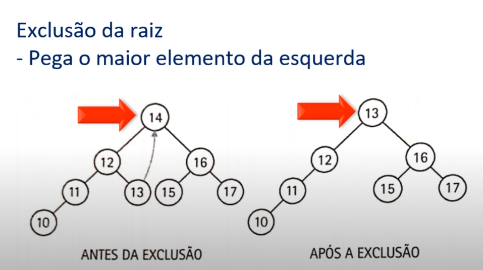

**Função**: Me escreva um Tutorial explicativo

**Tipo de Texto**: Tutorial explicativo passo a passo, detalhado para estudos e consultas futuras, semelhante a uma documentação. Use como referência o Livro "Lógica de programação e Estrutura de dados, Capitulo 13 da Sandra Puga e Gerson Risseti"

**Assunto**: Estrutura de dados em àrvores e suas implementações. Explicando operações básicas em árvores de busca binária

**Estilo**: Tutorial explicativo estilo documentação, detalhado para estudos e consultas futuras sobre o assunto estudado.

**Tom de voz**: Técnico, mas didático, de um desenvolvedor sênior, campeão do java champions, com mais de 15 anos de experiência de desenvolvimento, para pessoas de tecnologia.

Use como ponto de partida essas minhas anotações feitas em sala de aula para tonar o tutorial, mais fiel ao que estudo:

## INSERÇÃO

### REGRA GERAL:

- Maiores para a direita
- Menores para a esquerda

Entra pela RAIZ, faz a comparação de menor e maior.
    - Se menor vair para a esquerda
    - Se maior vai para direita
Repete o processo para os nó filhos até chegar na folha

## EXCLUSÃO

Exclusão da de No X ( neste exemplo a RAIZ )

- Pega o maior elemento da esquerda e SUBSTITUIMOS esse nó que excluimos.



## EXIBIÇÃO

Usa Algoritmo Recursivo para facilitar.

```java
public void showTree(BinBo noAtual){
    if(noAtual != null){
        showTree(noAtual.noEsq);
        System.out.println(noAtual.conteudo);
        showTree(noAtual.noDir);
    }
}
```

Agora use os itens em {Tutorial explicativo, detalhado} para o {ROTEIRO} seguindo as {REGRAS}

{Tutorial explicativo, detalhado}
[Autoridade]: Uanderson, um desenvolvedor Backend Java em formação
[Avatar]: Estudantes de programação

[Problema]: Explicando operações básicas em árvores de busca binária

{ROTEIRO}
Olá eu sou [Autoridade] e vou ajudar o [Avatar]
Hoje vamos resolver o [Problema]

{REGRAS}
> Siga o {ROTEIRO} acima e substitua os elementos entre [] por aqueles listados em {Tutorial explicativo, detalhado} acima.
> Mantenha o tom e ritmo, mas reescreva as palavras em {ROTEIRO} para que seja diferente do original, expandindo ou mudando conforme necessário.
> Use Analogias simples e hipérboles
> Utilize um tom de voz de um desenvolvedor sênior com mais de 15 anos de experiência.


