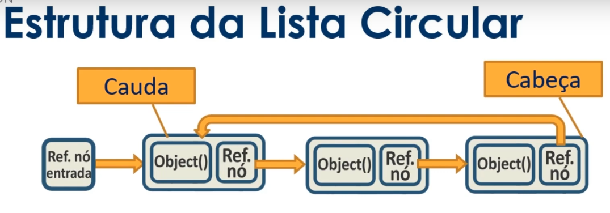

# Listas Circulares e Suas Implementações

Olá, eu sou Uanderson, um desenvolvedor Backend Java em formação.

## O que são Listas Circulares?

### Conceito

Listas circulares são uma estrutura de dados que se assemelha a listas encadeadas, mas com uma diferença crucial: o último nó da lista aponta de volta para o primeiro nó, formando um ciclo. Imagine um grupo de pessoas segurando as mãos em um círculo. Cada pessoa representa um nó, e a ligação entre elas é a referência que conecta um nó ao próximo.

### Representação Matemática

Em termos matemáticos, uma lista circular pode ser representada como um conjunto de pares ordenados \((N_1, N_2), (N_2, N_3), ..., (N_n, N_1)\), onde \(N_i\) é um nó e a última referência do último nó \(N_n\) volta para o primeiro nó \(N_1\). Esse ciclo permite que você percorra a lista indefinidamente, sem nunca chegar a um fim.

## Estrutura de Dados

### Componentes de uma Lista Circular

1. **Nó**: A unidade básica que contém dados e uma referência ao próximo nó.
2. **Cabeça (Head)**: Um ponteiro que aponta para o primeiro nó da lista.
3. **Cauda (Tail)**: Um ponteiro que pode ou não existir, apontando para o último nó da lista.

### Diagrama

A seguir, um exemplo de representação visual de uma lista circular:

```
[ Ref.Entrada ] ->   [ Tail/node ] --> [ Node ] --> [ Node ] -->  [ head/node ]
                            ^                                         |
                            |-----------------------------------------|
```



> VAI ENTRAR PELA CAUDA DA LISTA

### Metódo add


A gente Toma como referencia  de entrada a cauda ou a cabeça (a cauda nesse caso).

- desvincular a ref. de entrada da cauda atual
- inserir o novo nó
- novo nó vai apontar para a cauda da lista atual
- Muda a ref. de entrada para esse novo Nó.
- Muda a ref. de proximo nó da CABEÇA para o novo Nó inserido, pois ele passa a ser a nossa CAUDA (o primeiro)

## Vantagens e Desvantagens

### Vantagens

- **Acesso Eficiente**: A estrutura permite percorrer a lista sem se preocupar com o término.
- **Sem necessidade de ponteiro nulo**: A circularidade evita referências nulas, reduzindo o risco de erros.

### Desvantagens

- **Complexidade**: A manipulação pode ser mais complexa em comparação com listas encadeadas simples.
- **Difícil de depurar**: A possibilidade de ciclos infinitos pode dificultar a depuração.

