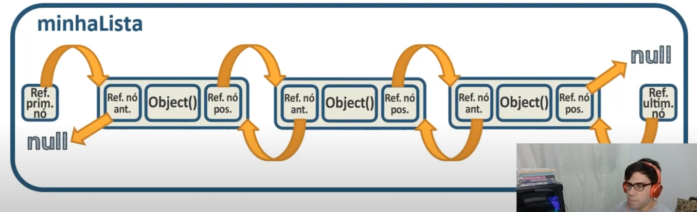
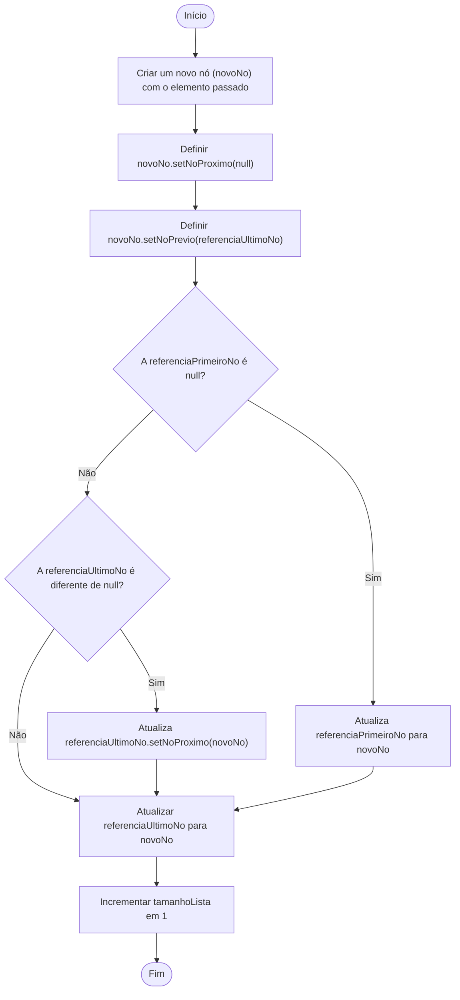
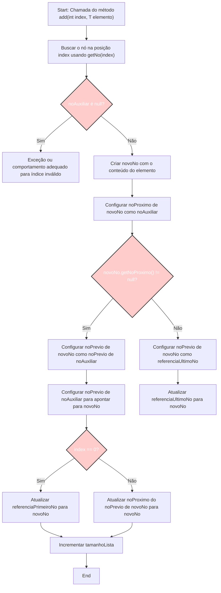

Aqui está a versão revisada e corrigida sobre **Listas Duplamente Encadeadas**, destacando os pontos importantes:

---

# Listas Duplamente Encadeadas

Uma **lista duplamente encadeada** é uma estrutura de dados onde cada elemento (nó) possui referências tanto para o **próximo nó** quanto para o **nó anterior**.

Em outras palavras, uma lista duplamente encadeada é como um **trem** que pode se mover **para frente e para trás**. Vamos imaginar que cada **vagão** do trem é um **nó** na lista.

### Estrutura do Trem

1. **Cada vagão** (nó) tem:
   - Um **espaço para as pessoas ou carga** (esse é o **valor** ou **dado armazenado** no nó).
   - Um **conector frontal** para se ligar ao vagão anterior (**referência para o nó anterior**).
   - Um **conector traseiro** para se ligar ao vagão posterior (**referência para o nó seguinte**).

2. O **primeiro vagão** (nó) é especial porque:
   - Ele **não** tem um conector frontal, já que **não há nada antes dele** (essa referência é `null`).

3. O **último vagão** também é especial porque:
   - Ele **não** tem um conector traseiro, já que **não há nada depois dele** (essa referência também é `null`).

### Funcionamento Prático

Se você está em um vagão:

- Você pode **olhar para frente** e ver o próximo vagão ou **olhar para trás** e ver o vagão anterior, podendo **mover-se em qualquer direção**.
- Isso facilita a **inserção** e **remoção** de vagões (nós), pois você tem acesso tanto ao vagão anterior quanto ao próximo, permitindo "desconectar" e "reconectar" os vagões sem precisar desmontar o trem inteiro.

### Resumindo com a Analogia do Trem

- A **lista duplamente encadeada** permite navegação **nos dois sentidos**.
- Cada vagão tem **duas conexões**: uma com o vagão à frente e outra com o de trás.
- É fácil **adicionar** ou **remover** vagões, já que é possível identificar quem está antes e quem está depois.

Essa estrutura é mais **flexível** que uma lista simplesmente encadeada, pois permite navegação bidirecional e facilita operações de busca ou modificação.

### Estrutura Básica do Nó

1. **Referência para o nó anterior**: Indica o endereço ou a referência para o nó anterior. Se for o primeiro nó, essa referência é `null`.
2. **Valor armazenado**: Representa o dado no nó, que pode ser de qualquer tipo.
3. **Referência para o nó posterior**: Indica o endereço ou a referência para o próximo nó na lista. Se for o último nó, essa referência é `null`.

## Visualização da Estrutura de um Nó

### 1° Estrutura de um nó

Cada Nó possui duas referências:

- 1°: Nó anterior (está atrás)
- 2°: Nó posterior (está na frente)

Também Temos duas Referências de entrada

- 1°: Referência do PRIMEIRO NÓ
- 2°: Referência do ÚLTIMO NÓ

**Primeira Imagem**: Mostra um **único nó** com seus campos principais: a referência para o nó anterior, o valor armazenado, e a referência para o próximo nó.

- **Referência do primeiro nó**: Aponta para o início da lista.
- **Referência do último nó**: Aponta para o fim da lista.

Isso permite navegação fácil em ambas as direções, uma das principais vantagens dessa estrutura.

---

### 2° Estrutura de um nó com as referências de entrada

Cada Nó possui duas referências: (OKAY)

1. **Nó anterior**: Aponta para o nó que está antes dele na lista ou para `NULL` se for o primeiro nó.

2. **Nó posterior**: Aponta para o nó que está depois dele na lista ou para `NULL` se for o último nó.

Temos duas Referências de entrada (OKAY)

As referências de entrada são:

1. **Referência do PRIMEIRO NÓ**: Aponta para o primeiro nó da lista. O campo "nó anterior" deste nó será `NULL`.

2. **Referência do ÚLTIMO NÓ**: Aponta para o último nó da lista. O campo "nó posterior" deste nó será `NULL`.

**Segunda Imagem**: Exibe uma **lista completa** com vários nós conectados.

- A lista começa com a **"Referência do primeiro nó"**, apontando para o nó inicial, que tem sua referência anterior como `null`.
- Cada nó subsequente se conecta ao anterior e ao seguinte, formando uma cadeia.
- O último nó da lista é referenciado pela **"Referência do último nó"**, e sua referência posterior é `null`.

### Características Principais

- **Navegação bidirecional**: Cada nó tem referências para o anterior e o próximo, permitindo percorrer a lista em ambas as direções e facilitando inserções e remoções em qualquer posição.
- **Estrutura flexível**: A lista pode crescer ou diminuir dinamicamente, já que os nós podem ser conectados ou desconectados sem a necessidade de realocar todos os elementos (ao contrário de um array).

### Ilustração e Exemplificação

Na segunda imagem, as setas indicam como os nós estão conectados:

- Setas **laranjas curvas** mostram como cada nó aponta para o próximo e para o anterior, mantendo a estrutura e integridade da lista.
- Os valores `null` nos extremos indicam que não há nós além do primeiro e do último, estabelecendo os limites da lista.

### Implementação

Uma lista duplamente encadeada normalmente possui duas referências principais:

1. **Primeiro nó** (cabeça ou "head").
2. **Último nó** (cauda ou "tail").

Essas referências permitem operações eficientes, como adicionar um elemento no final da lista acessando diretamente a cauda, sem precisar percorrer todos os nós.

---

### Fluxograma method add(T elemento){}

### Fluxograma method add(int index, T elemento){}

